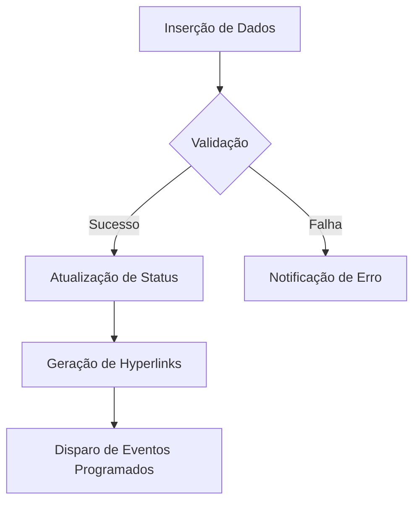

# **Sistema de Controle de Serviços Técnicos e Gestão de Materiais**

## **1. Visão Geral do Sistema**
Solução integrada para rastreamento de serviços de manutenção, associando ativos técnicos, documentação relacionada e recursos materiais necessários. Implementado em Microsoft Excel com automações via VBA, proporcionando:

- Centralização de informações técnicas
- Rastreabilidade de prazos
- Cálculo automático de materiais
- Geração de relatórios padronizados

## **2. Arquitetura da Solução**

### **2.1 Estrutura de Dados**
| Campo              | Tipo        | Validação               | Descrição                              |
|--------------------|-------------|-------------------------|----------------------------------------|
| Código Ativo       | Texto       | `=ÉTEXTO(A2)`           | Identificador único do equipamento     |
| Relatório Técnico  | Hyperlink   | Link absoluto/relativo  | Vinculação a arquivos PDF              |
| Lista de Materiais | Hyperlink   | `=SEERRO(HYPERLINK(...))`| Integração com planilhas de recursos   |
| Data Prevista      | Data        | `=SE(E2<HOJE();"ATRASADO")` | Controle de deadlines                |

### **2.2 Módulos Principais**

#### **Módulo de Automação (VBA)**
```vba
' =============================================
' Módulo: Backup Automático
' Objetivo: Gera versões diárias com timestamp
' =============================================
Sub AutoBackup()
    Dim backupPath As String
    backupPath = ThisWorkbook.Path & "\backups\" & Format(Now, "yyyy-mm-dd") & ".xlsm"
    ThisWorkbook.SaveCopyAs backupPath
End Sub
```

#### **Módulo de Análise**
```excel
=LET(
    dados, FILTRO(TabelaServiços; TabelaServiços[Status]="Pendente"),
    ORDENAR(dados; MATCH("Data Prevista"; Cabeçalhos; 0); 1)
```

## **3. Especificações Técnicas**

### **3.1 Requisitos do Sistema**
- **Plataforma**: Microsoft Excel 365 ou superior
- **Dependências**:
  - Habilitação de macros
  - Acesso a redes corporativas (para links de arquivos)
- **Segurança**:
  - Assinatura digital de macros
  - Controle de acesso via `Environ("USERNAME")`

### **3.2 Fluxo de Processamento**


## **4. Implementação**

### **4.1 Estrutura de Diretórios**
```
📂 raiz/
├── 📁 docs/                  # Documentação técnica
├── 📁 modules/               # Códigos VBA modulares
│   ├── backup_handler.bas    # Rotinas de backup
│   └── report_generator.cls  # Geração de relatórios
├── 📁 templates/             # Modelos padronizados
└── 📁 tests/                 # Casos de teste
```

### **4.2 Instruções de Implantação**
1. Configurar caminhos absolutos em `Config.vba`
2. Importar módulos via VBA Editor (Alt+F11)
3. Definir permissões de rede para acesso a:
   ```vbnet
   \\fileserver\engenharia\relatorios\
   \\fileserver\projetos\
   ```

## **5. Referências Técnicas**
- ISO 55000: Gestão de ativos físicos
- NBR ISO/IEC 27001: Segurança da informação
- Manual de Codificação VBA (Microsoft, 2022)

---

**Nota de Versão**: 1.0.0  
**Última Atualização**: `=TEXTO(AGORA(); "dd/mm/aaaa")`  

Este documento segue as diretrizes IEEE 830-1998 para especificação de requisitos. Para customizações empresariais, consulte o manual de integração em `/docs/integration_guide.pdf`.
